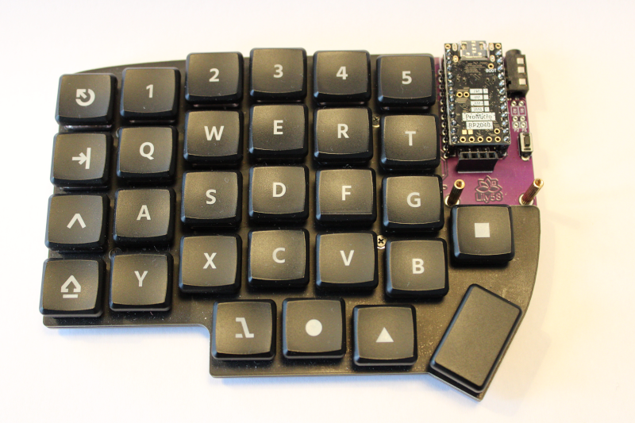

# Lily58 with rp2040 promicro compatible controller and KMK

## Purpose

I wanted to use an rp2040 in a [lily58](https://github.com/kata0510/Lily58) to be able to use [kmk](https://github.com/KMKfw) on a lily build already working with QMK. 
The idea was to just swap the controller and try a different software, I did not want to plan and/or order all new PCBs around Picos, and rp2040 promicro controllers are cheap to get.

## Parts

- an assembled lily58
- a promirco drop-in rp2040 board, I used [Tenstar RP2040 Pro Micro Development Board 4MB/16MB Dual-Core](https://de.aliexpress.com/item/1005006599393967.html?gatewayAdapt=glo2deu)
- trrs cable (trs will work with the atmega 32u4 but not the rp2040s)
- solder the controllers onto the pin headers exactly as with the regular promicros (chips down), leaving the topmost holes (the ones closest to the usb port) empty

## Not covered

I have no RGB and no rotary encoders, so that is not covered.

## Setup

Using [circuitpython sparkfun pro micro rp2040](https://circuitpython.org/board/sparkfun_pro_micro_rp2040/) for circuitpython worked.

Install it by downloading and drag and drop it to the controller showing up as a usb device (RPI-RP2) - if not hold the BOOT or BOOTSEL button while plugging the usb cable in and releasing it. 
After copying the file the device will automatically vanish and reappear as CIRCUITPY (if not try several times, they might be a little stubborn at times).

Then install KMK (drag and drop the kmk folder and boot.py onto the device).

At this point it is a good idea to download [picocom](https://github.com/npat-efault/picocom) and access the device from it (for me it was ./picocom /dev/ttyACM0 on ubuntu) so you can debug stuff.

It is a good idea to name the two controllers differently for left and right to not get confused, [see](https://learn.adafruit.com/welcome-to-circuitpython/renaming-circuitpy) - ideally you want the names to end with L or R respectively to not have to configure it in the source code.

For the keyboard to work you will basically need two files:

	1. kb.py, defining the layout and pins
	2. code.py, the keymap and configuration (split, media keys etc.)

## Figure out pins for other boards

[Circuitpython](https://learn.adafruit.com/circuitpython-essentials/circuitpython-pins-and-modules) has a nice script to get the names correct if you got a pinout schematic for your board.